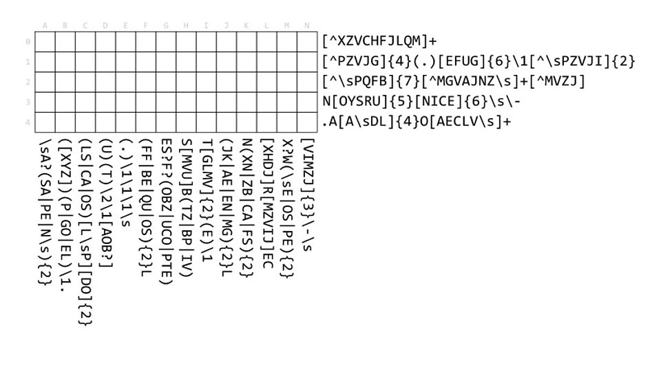

## Puzzle No. 3 – Wednesday 5 July

### This is no ordinary crossword!

> Instead of a word or phrase, each clue is a regular expression (or a ‘regex’).
> To complete the puzzle, find the letter matching both the horizontal and
> vertical regex for each square.
> 
> 
> 
> (_[source](http://www.bbc.co.uk/programmes/articles/5LCB3rN2dWLqsmGMy5KYtBf/puzzle-for-today)_)

---

OK, so first thing, let's (painstakingly) write out the
[Regular Expressions](http://www.regular-expressions.info/) that are in the
attached image:

    0: [^XZCVHFJLQM]+
    1: [^PZVJG]{4}(.)[EFUG]{6}\1[^\sPZVJI]{2}
    2: [^\sPQFB]{7}[^MGVAJNZ\s]+[^MVZJ]
    3: N[OYSRU]{5}[NICE]{6}\s\-
    4: .A[A\sDL]{4}O[AECLV\s]+
    
    A: \sA?(SA|PE|N\s){2}
    B: ([XYZ])(P|GO|EL)\1.
    C: (LS|CA|OS)[L\sP][DO]{2}
    D: (U)(T)\2\1[AOB?]
    E: (.)\1\1\1\s
    F: (FF|BE|QU|OS){2}L
    G: ES?F?(OBZ|UCO|PTE)
    H: S[MVU]B(TZ|BP|IV)
    I: T[GLMV]{2}(E)\1
    J: (JK|AE|EN|MG){2}L
    K: N(XN|ZB|CA|FS){2}
    L: [XHDJ]R[MZVIJ]EC
    M: X?W(\sE|OS|PE){2}
    N: [VIMZJ]{3}\-\s

There are several [Character Classes](http://www.regular-expressions.info/charclass.html)
used throughout the puzzle, but the [Literals](http://www.regular-expressions.info/characters.html)
within the character class aren't sorted alphabetically, which makes
it hard to see the similarities between say `[^MVZJ]` and `[VIMZJ]`.

So, let's sort the literals to makes things easier for us down the road. We'll
use this going forward.

    # Character Classes Sorted
    
    0: [^CFHJLMQVXZ]+
    1: [^GJPVZ]{4}(.)[EFGU]{6}\1[^IJPVZ\s]{2}
    2: [^BFPQ\s]{7}[^AGJMNVZ\s]+[^JMVZ]
    3: N[ORSUY]{5}[CEIN]{6}\s\-
    4: .A[ADL\s]{4}O[ACELV\s]+
    
    A: \sA?(SA|PE|N\s){2}
    B: ([XYZ])(P|GO|EL)\1.
    C: (LS|CA|OS)[LP\s][DO]{2}
    D: (U)(T)\2\1[ABO?]
    E: (.)\1\1\1\s
    F: (FF|BE|QU|OS){2}L
    G: ES?F?(OBZ|UCO|PTE)
    H: S[MUV]B(TZ|BP|IV)
    I: T[GLMV]{2}(E)\1
    J: (JK|AE|EN|MG){2}L
    K: N(XN|ZB|CA|FS){2}
    L: [DHJX]R[IJMVZ]EC
    M: X?W(\sE|OS|PE){2}
    N: [IJMVZ]{3}\-\s

OK, so let's setup our blank "board." I'm using dots (`.`) to denote a space
where we don't know the answer. At the start, we only have dots!

    +---+-----------------------------+
    |░░░| A B C D E F G H I J K L M N |
    +---+-----------------------------+ 
    | 0 | . . . . . . . . . . . . . . |
    | 1 | . . . . . . . . . . . . . . |
    | 2 | . . . . . . . . . . . . . . |
    | 3 | . . . . . . . . . . . . . . |
    | 4 | . . . . . . . . . . . . . . |
    +---+-----------------------------+ 

